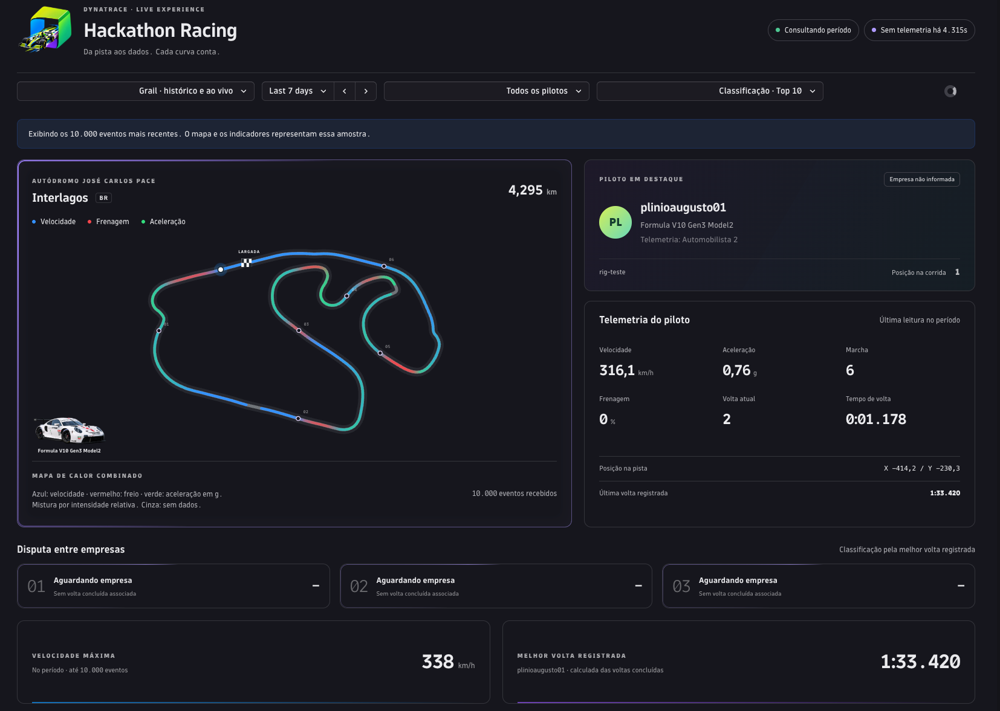
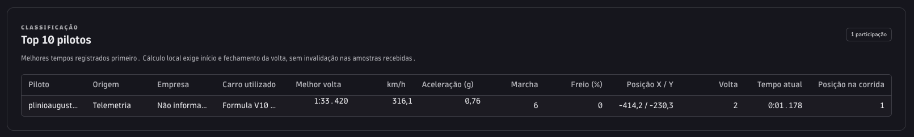
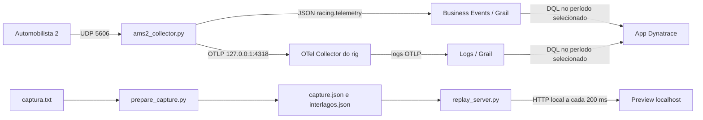

# Dynatrace Hackathon Racing

App em desenvolvimento para um evento da Dynatrace: participantes pilotam em simuladores e acompanham a telemetria de Interlagos em um painel com mapa de calor, tempos e classificação.

## Como o projeto começou 

Fomos a um local com simuladores e capturamos os pacotes UDP do Automobilista 2 usando um script Python. O dump `captura.txt` conserva timestamp, endereço, tamanho e bytes em hexadecimal. A partir desses pacotes, decodificamos os dados do carro e construímos o app. A captura de 19/09/2026 permite desenvolver sem conexão com o simulador.

A versão **0.3.0** é um checkpoint de desenvolvimento. OpenPipeline, cadastro piloto/empresa, logos e workflow de métricas são próximos passos; não estão provisionados nesta release.

## Primeiro dado real de um rig





Telemetria real do Automobilista 2, saindo de um simulador Windows via o pacote `HackathonRacing.exe`, passando pelo OTel Collector local e chegando ao Grail. Nenhum evento sintético nessas capturas — é o pipeline completo (UDP → coletor → collector → Dynatrace) validado de ponta a ponta.

## De onde vêm os valores



| Informação | Campo | Origem / transformação |
| --- | --- | --- |
| Velocidade | `speed_kmh` | Telemetry: m/s convertidos para km/h |
| Frenagem | `brake_pct` | Intensidade do freio convertida para percentual |
| Aceleração | `acceleration_g` | Magnitude da aceleração local em g; inclui curvas e frenagem, não é posição do acelerador |
| Posição | `pos_x`, `pos_y` | Coordenadas globais X/Z projetadas em 2D |
| Marcha | `gear` | Pacote Telemetry |
| Volta / tempo atual | `lap_number`, `lap_time_s` | Pacote Timings |
| Última / melhor volta | `last_lap_s`, `best_lap_s` | Time Stats; melhor também pode vir da definição de corrida |
| Piloto / carro | `driver_name`, `car_name` | Participants / Vehicle Names |
| Simulador / participação | `rig.id`, `session.id` | Identificadores adicionados pelo coletor |
| Empresa | `company_name` | Enriquecimento futuro; não existe no dump UDP |

O traçado foi extraído de uma volta completa: 467 pontos, simplificados para renderização SVG suave. Cada amostra é associada ao ponto mais próximo, até 35 metros. O calor representa a média por trecho, suavizada entre vizinhos. Trechos sem amostras continuam cinza. Outros pilotos usam o mesmo mapa enquanto estiverem na mesma versão de Interlagos; outra pista exige outro traçado. Os seis marcadores são referências visuais, não a numeração oficial das curvas.

## Demonstração com quatro pilotos

`python replay_server.py` reproduz o piloto original e adiciona **Bruno Lima / Dynatrace**, **Joãozinho / Bradesco** e **Agnes / Caixa**. Os três adicionais têm `source=demo` e `simulation=true`; os vínculos de empresa são fictícios para testar o pódio. A mesma trajetória é reproduzida com ritmo e largada diferentes, gerando 8.324 eventos e quatro tempos finais distintos. Posição e ritmo não são novas capturas de pessoas reais. Não há ingestão nessa demonstração.

### Gerador UDP com variações

O gerador é uma ferramenta opcional, independente do app publicado. Para validar
sem enviar dados à tenant, abra dois terminais na raiz do repositório:

```powershell
# Terminal 1: somente decodificar e imprimir eventos de teste
python ams2_collector.py --source udp --bind 127.0.0.1 --port 15606 --rig-id ensaio-udp --dry-run
```

```powershell
# Terminal 2: uma reprodução local, em porta separada dos simuladores
python cars2_telemetry_generator.py --host 127.0.0.1 --port 15606 --speed 4 --speed-pct 10
```

Esse fluxo não alimenta o servidor HTTP `replay_server.py` nem o Grail automaticamente.
O UDP mantém os nomes e tempos da captura, não cria novos pilotos/empresas e não
marca os pacotes como sintéticos. Evite encaminhá-lo ao coletor de produção: os
valores alterados poderiam entrar no histórico e ranking como telemetria real.
Variações de posição podem afastar pontos do traçado; mudanças de velocidade não
recalculam tempos de volta. Para verificar os scripts: `python -m unittest discover`.


`cars2_telemetry_generator.py` reproduz os pacotes CARS2 originais na porta UDP e pode
alterar campos confirmados da telemetria por percentual. Um valor `10` aumenta o campo
em 10%; `-20` reduz em 20%; `0` preserva o valor original.

```bash
python3 cars2_telemetry_generator.py --loop --speed 4 \
  --speed-pct 10 --throttle-pct 5 --brake-pct -10 --gear-pct -15 \
  --acceleration-pct 20 --position-x-pct 2 --position-y-pct -3
```

Os pedais são limitados a `0..100%`, a marcha é arredondada para uma marcha válida e a
ré é preservada. `--acceleration-pct` altera o vetor de aceleração física XYZ;
`--throttle-pct` altera o pedal. Para o mapa 2D, `position-y` corresponde ao eixo Z do
mundo do jogo. Somente pacotes `telemetry` tipo 0 versão 4 são modificados; timings,
voltas, participantes e demais pacotes continuam idênticos à captura.

Para somente o piloto original: `python replay_server.py --recorded-only`.

O mapa combinado calcula médias espaciais das três medidas. As contribuições relativas usam `(freio/35)^3`, `(aceleração/3.5)^3` e `(velocidade/320)^3`, normalizadas para misturar RGB vermelho, verde e azul. A frenagem recebe ênfase visual. A cor combinada não representa uma unidade física ou um índice oficial; é uma visualização simultânea das três medidas. Os valores numéricos continuam disponíveis na telemetria.

## Tempos de volta

O replay inclui agora a confirmação após a chegada: **2.081 eventos por piloto**. A volta original dura cerca de 104 segundos em 1×. Antes ele parava imediatamente antes dessa confirmação e deixava a última volta vazia.

A captura informa `last_lap_s = 104.015`, mas não informa `best_lap_s`. A interface diferencia o melhor tempo informado pelo simulador do melhor calculado entre voltas concluídas. O cálculo local exige observar o início (até 1 segundo), a transição para a próxima volta e nenhuma invalidação nas amostras recebidas. Não transforma tempo parcial ou uma última volta isolada em recorde. Isso não substitui validação oficial quando há perda de pacotes. O indicador **Melhor volta registrada** mostra a origem do cálculo.

## Executar localmente — PowerShell

Pré-requisitos: Git, Python 3.10+ e Node.js 22.18+ (recomendado, inclusive para os testes TypeScript). Python usa apenas a biblioteca padrão.

```powershell
git clone https://github.com/brunoxy01/Dynatrace-Hackathon-Racing.git
cd Dynatrace-Hackathon-Racing
git checkout v0.3.0
cd dynatrace-hackathon-racing
npm ci
npm start -- --no-open --port 3000
```

Em um segundo terminal, na raiz do repositório:

```powershell
python replay_server.py
```

Abra http://localhost:3000/ui, escolha **Script · tempo real** e clique em **Iniciar simulação**. A pista começa cinza. O mapa combina velocidade (azul), frenagem (vermelho) e aceleração em g (verde), sem clicar. As legendas apenas explicam as cores. Pausar, Continuar, Limpar pista e Repetir volta controlam o replay. Mantenha o script aberto; Ctrl+C encerra.

```powershell
# Opcional, após encerrar o servidor anterior
python replay_server.py --speed 4
# Regenerar os JSON a partir do dump original
python prepare_capture.py
```

**Replay da captura** usa o arquivo inteiro no navegador e dispensa o servidor Python. Nenhum desses modos ingere dados no Dynatrace. O App Toolkit pode solicitar autenticação no ambiente de `dynatrace-hackathon-racing/app.config.json`.

## Preparar os simuladores para o evento

1. No AMS2, habilite a saída UDP e selecione o protocolo Project CARS 2. Confira frequência e porta no local; o coletor usa 5606 por padrão.
2. Execute um coletor por simulador, com `rig-id` diferente. Confirme a chegada dos pacotes na máquina receptora e teste rede/firewall no local.
3. Antes de cada nova participação, reinicie o coletor para gerar nova `session.id`. Confirme o nome no jogo: o mesmo perfil sem separar sessões mistura participantes.
4. Abra **Grail · histórico e ao vivo** e selecione o período desejado. O padrão são os últimos 7 dias; o seletor Strato oferece horas, hoje, ontem e datas personalizadas. Intervalos terminando em agora atualizam a cada 30 segundos; períodos fechados podem ser atualizados manualmente. A consulta retorna até 10.000 eventos recentes no intervalo e avisa quando atinge esse limite. Rankings representam essa amostra; para classificar todo o evento ainda é necessário persistir/agregar resultados no backend.

Primeiro, teste sem ingestão:

```powershell
python ams2_collector.py --source udp --port 5606 --rig-id rig-01 --rig-name "Simulador 1" --dry-run
```

Para ingerir, este coletor usa Classic API token com escopo `bizevents.ingest` e Environment API v2. Configure `DT_ENV_URL` com a URL do ambiente classic (`https://SEU_AMBIENTE.live.dynatrace.com`) e `DT_API_TOKEN` com seu token apenas na sessão do terminal. Não salve credenciais no repositório. Depois execute:

```powershell
python ams2_collector.py --source udp --port 5606 --rig-id rig-01 --rig-name "Simulador 1"
# Ensaio de ingestão com o dump, sem o jogo
python ams2_collector.py --source replay --file captura.txt --speed 1 --rig-id ensaio-01 --rig-name "Ensaio"
```

O envio real consome ingestão. O coletor registra falhas HTTP, mas não possui fila persistente/reenvio. Valide isso antes de usá-lo como registro oficial da competição. Não use `--loop` para resultados competitivos; mantenha ensaios separados do evento.

Referência: [ingestão de business events](https://docs.dynatrace.com/docs/observe/business-observability/bo-events-capturing/bo-events-capturing-external-sources). OpenPipeline recebe o JSON decodificado, não os bytes UDP diretamente.

### Caminho alternativo: OTel Collector no rig

Além da API de business events, o coletor entrega a mesma telemetria via OTLP a um **OTel Collector rodando na própria máquina do simulador**, que repassa ao Dynatrace como logs. `--sink` escolhe os destinos: `bizevents` (padrão), `otlp` ou `both`.

Por que os dois caminhos coexistem: business events e OTLP são ingestões distintas e **não se convertem entre si** — um collector não consegue produzir bizevents, e OTLP sempre cai em `logs`/`spans`/`metrics`. Em vez de escolher um e arriscar, o app consulta as duas fontes com queries independentes e junta os resultados deduplicando por `sample.id`. Se um dos caminhos estiver fora do ar, o painel continua funcionando com o outro.

O caminho OTLP ganha o que a API direta não tem: **fila em disco e reenvio automático**. Se a rede do evento oscilar, o collector segura as amostras em `fila-otel/` e as entrega depois.

Para os rigs Windows, use o pacote de duplo clique em [rig/](rig/README.md). Para ensaiar a cadeia inteira sem gastar ingestão nem precisar de token:

```bash
python3 otel/endpoint_falso.py                                        # terminal 1
./dynatrace-otel-collector --config otel/otelcol-teste-local.yaml     # terminal 2
python3 ams2_collector.py --source udp --port 15606 --rig-id ensaio --sink otlp  # terminal 3
python3 cars2_telemetry_generator.py --host 127.0.0.1 --port 15606 --speed 20    # terminal 4
```

O token de ingestão precisa de `bizevents.ingest` **e** `logs.ingest`. O app precisa dos escopos `storage:bizevents:read` e `storage:logs:read`.

## Validar e publicar no ambiente

```powershell
# Raiz do repositório
python test_protocol.py
python -m unittest test_replay.py
cd dynatrace-hackathon-racing
npm ci
npm test
npm run lint
npm run build
# Ajuste environmentUrl em app.config.json antes do deploy
npm run deploy
```

A release no GitHub guarda código e pacote construído; não faz deploy no Dynatrace. O projeto usa React, TypeScript, App Toolkit e Strato, com [design tokens oficiais](https://developer.dynatrace.com/design/design-tokens/). O espectro do mapa é uma escala de dados própria. As três bordas do pódio usam movimento roxo suave e sincronizado. A borda do card da pista usa a mesma animação com roxo mais intenso. Ambas respeitam a preferência de reduzir movimento.

## Estrutura e continuidade

- `ams2_protocol.py`: decodificador UDP.
- `ams2_collector.py`: coleta ao vivo ou replay para ingestão. `--sink bizevents|otlp|both` escolhe os destinos.
- `rig/`: pacote de duplo clique para os simuladores Windows. Ver [rig/README.md](rig/README.md).
- `otel/`: config do OTel Collector do rig (`otelcol-racing.yaml`) e o ensaio sem Dynatrace (`otelcol-teste-local.yaml` + `endpoint_falso.py`).
- `captura.txt`: dump original usado nos testes.
- `prepare_capture.py`: reconstrução da telemetria e do traçado.
- `replay_server.py`: servidor local em loopback, porta 3001.
- `mock_telemetry_generator.py`: dados sintéticos opcionais, separados da captura real.
- `dynatrace-hackathon-racing/ui/app/`: dashboard, mapa, agregação e conexão local.
- `docs/images/`: screenshots desta versão.

Para retomar a partir desta release:

```powershell
git switch -c feature/proximas-melhorias v0.3.0
```

Próxima etapa: cadastro piloto/empresa, enriquecimento no OpenPipeline, logos aprovadas e workflow/agregações de resultados duráveis. Também falta validar troca de sessões, perda de UDP e carga com todos os simuladores reais.

## Acesso na tenant

Ambiente configurado: https://bwm98081.apps.dynatrace.com

App: https://bwm98081.apps.dynatrace.com/ui/apps/my.dynatrace.hackathon.racing

O seletor de período consulta eventos já ingeridos no Grail. A demonstração executada pelo servidor local não grava eventos na tenant; por isso ampliar o período não transforma essas simulações em histórico. O app publicado oferece também o replay da captura empacotada, sem depender do servidor Python. O modo Script é exclusivo do preview localhost.

Para republicar alterações validadas: `npm run deploy -- --no-open` na pasta `dynatrace-hackathon-racing`. A conta Dynatrace precisa de permissão para instalar/atualizar apps.

## Carro escolhido para o evento

O carro do evento será o **Porsche 911**, ilustrado no canto inferior esquerdo do mapa. O campo **Carro na telemetria** conserva o nome recebido do simulador: capturas antigas não são renomeadas para Porsche. Novas sessões com o Porsche selecionado no AMS2 devem informar esse modelo via UDP. Eventos antigos que registraram Camaro continuam com esse valor no Grail; o decodificador atual já distingue pacotes de nomes de veículos dos nomes de classes.

A imagem `ui/assets/porsche-911.png` foi derivada da imagem fornecida pelo organizador usando a ferramenta integrada imagegen. Prompt: remover todo o cenário, preservar o Porsche branco, perspectiva e pintura, com fundo transparente e enquadramento próximo ao carro.
