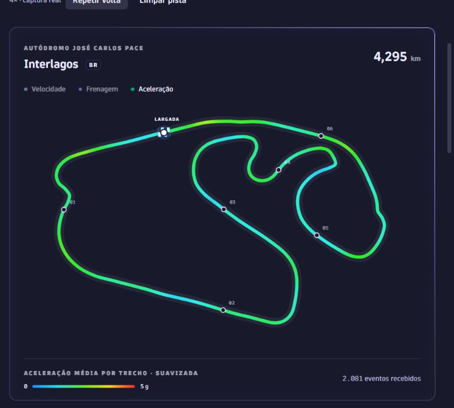
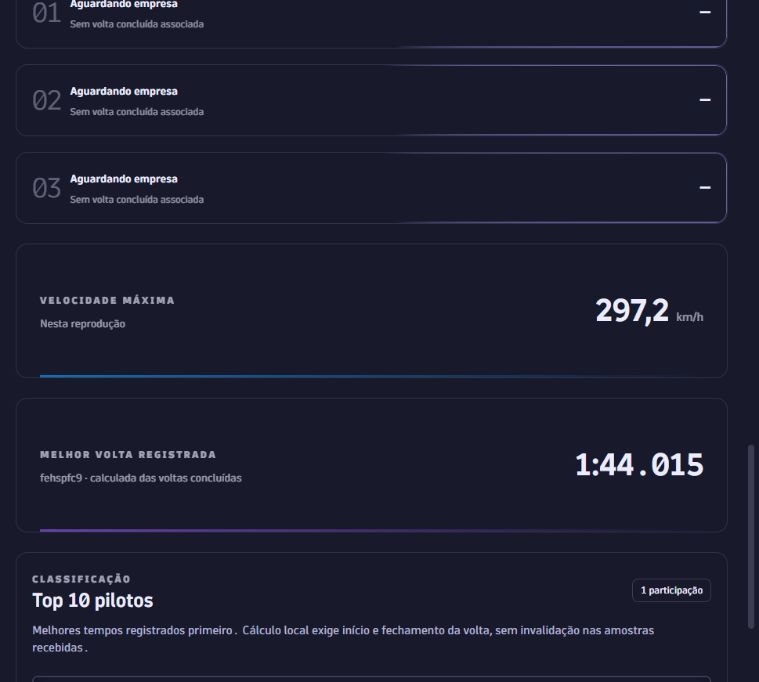
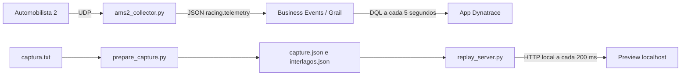

# Dynatrace Hackathon Racing

App em desenvolvimento para um evento da Dynatrace: participantes pilotam em simuladores e acompanham a telemetria de Interlagos em um painel com mapa de calor, tempos e classificação.

## Como o projeto começou

Fomos a um local com simuladores e capturamos os pacotes UDP do Automobilista 2 usando um script Python. O dump `captura.txt` conserva timestamp, endereço, tamanho e bytes em hexadecimal. A partir desses pacotes, decodificamos os dados do carro e construímos o app. A captura de 19/09/2026 permite desenvolver sem conexão com o simulador.

A versão **0.2.0** é um checkpoint de desenvolvimento. OpenPipeline, cadastro piloto/empresa, logos e workflow de métricas são próximos passos; não estão provisionados nesta release.

## Prints do app





As imagens usam a captura real. As empresas permanecem vazias porque o UDP não informa esse vínculo.

## De onde vêm os valores



| Informação | Campo | Origem / transformação |
| --- | --- | --- |
| Velocidade | `speed_kmh` | Telemetry: m/s convertidos para km/h |
| Frenagem | `brake_pct` | Intensidade do freio convertida para percentual |
| Aceleração | `acceleration_g` | Magnitude da aceleração local em g; inclui curvas e frenagem, não é posição do acelerador |
| Posição | `pos_x`, `pos_y` | Coordenadas globais X/Z projetadas em 2D |
| Marcha | `gear` | Pacote Telemetry |
| Volta / tempo atual | `lap_number`, `lap_time_s` | Pacote Timings |
| Última / melhor volta | `last_lap_s`, `best_lap_s` | Time Stats; melhor também pode vir da definição de corrida |
| Piloto / carro | `driver_name`, `car_name` | Participants / Vehicle Names |
| Simulador / participação | `rig.id`, `session.id` | Identificadores adicionados pelo coletor |
| Empresa | `company_name` | Enriquecimento futuro; não existe no dump UDP |

O traçado foi extraído de uma volta completa: 467 pontos, simplificados para renderização SVG suave. Cada amostra é associada ao ponto mais próximo, até 35 metros. O calor representa a média por trecho, suavizada entre vizinhos. Trechos sem amostras continuam cinza. Outros pilotos usam o mesmo mapa enquanto estiverem na mesma versão de Interlagos; outra pista exige outro traçado. Os seis marcadores são referências visuais, não a numeração oficial das curvas.

## Tempos de volta

O replay inclui agora a confirmação após a chegada: **2.081 eventos**, cerca de 104 segundos em 1×. Antes ele parava imediatamente antes dessa confirmação e deixava a última volta vazia.

A captura informa `last_lap_s = 104.015`, mas não informa `best_lap_s`. A interface diferencia o melhor tempo informado pelo simulador do melhor calculado entre voltas concluídas. O cálculo local exige observar o início (até 1 segundo), a transição para a próxima volta e nenhuma invalidação nas amostras recebidas. Não transforma tempo parcial ou uma última volta isolada em recorde. Isso não substitui validação oficial quando há perda de pacotes. O indicador **Melhor volta registrada** mostra a origem do cálculo.

## Executar localmente — PowerShell

Pré-requisitos: Git, Python 3.10+ e Node.js 22.18+ (recomendado, inclusive para os testes TypeScript). Python usa apenas a biblioteca padrão.

```powershell
git clone https://github.com/brunoxy01/Dynatrace-Hackathon-Racing.git
cd Dynatrace-Hackathon-Racing
git checkout v0.2.0
cd dynatrace-hackathon-racing
npm ci
npm start -- --no-open --port 3000
```

Em um segundo terminal, na raiz do repositório:

```powershell
python replay_server.py
```

Abra http://localhost:3000/ui, escolha **Script · tempo real** e clique em **Iniciar simulação**. A pista começa cinza. As legendas alternam Velocidade, Frenagem e Aceleração. Pausar, Continuar, Limpar pista e Repetir volta controlam o replay. Mantenha o script aberto; Ctrl+C encerra.

```powershell
# Opcional, após encerrar o servidor anterior
python replay_server.py --speed 4
# Regenerar os JSON a partir do dump original
python prepare_capture.py
```

**Replay da captura** usa o arquivo inteiro no navegador e dispensa o servidor Python. Nenhum desses modos ingere dados no Dynatrace. O App Toolkit pode solicitar autenticação no ambiente de `dynatrace-hackathon-racing/app.config.json`.

## Preparar os simuladores para o evento

1. No AMS2, habilite a saída UDP e selecione o protocolo Project CARS 2. Confira frequência e porta no local; o coletor usa 5606 por padrão.
2. Execute um coletor por simulador, com `rig-id` diferente. Confirme a chegada dos pacotes na máquina receptora e teste rede/firewall no local.
3. Antes de cada nova participação, reinicie o coletor para gerar nova `session.id`. Confirme o nome no jogo: o mesmo perfil sem separar sessões mistura participantes.
4. Abra **Grail · novos eventos** antes da largada. Esse modo considera eventos desde sua abertura, dentro da consulta de 30 minutos e limite de 10.000 registros. Para vários simuladores ou classificação de todo o evento, ainda é necessário agregar/persistir resultados no backend.

Primeiro, teste sem ingestão:

```powershell
python ams2_collector.py --source udp --port 5606 --rig-id rig-01 --rig-name "Simulador 1" --dry-run
```

Para ingerir, este coletor usa Classic API token com escopo `bizevents.ingest` e Environment API v2. Configure `DT_ENV_URL` com a URL do ambiente classic (`https://SEU_AMBIENTE.live.dynatrace.com`) e `DT_API_TOKEN` com seu token apenas na sessão do terminal. Não salve credenciais no repositório. Depois execute:

```powershell
python ams2_collector.py --source udp --port 5606 --rig-id rig-01 --rig-name "Simulador 1"
# Ensaio de ingestão com o dump, sem o jogo
python ams2_collector.py --source replay --file captura.txt --speed 1 --rig-id ensaio-01 --rig-name "Ensaio"
```

O envio real consome ingestão. O coletor registra falhas HTTP, mas não possui fila persistente/reenvio. Valide isso antes de usá-lo como registro oficial da competição. Não use `--loop` para resultados competitivos; mantenha ensaios separados do evento.

Referência: [ingestão de business events](https://docs.dynatrace.com/docs/observe/business-observability/bo-events-capturing/bo-events-capturing-external-sources). OpenPipeline recebe o JSON decodificado, não os bytes UDP diretamente.

## Validar e publicar no ambiente

```powershell
# Raiz do repositório
python test_protocol.py
python -m unittest test_replay.py
cd dynatrace-hackathon-racing
npm ci
npm test
npm run lint
npm run build
# Ajuste environmentUrl em app.config.json antes do deploy
npm run deploy
```

A release no GitHub guarda código e pacote construído; não faz deploy no Dynatrace. O projeto usa React, TypeScript, App Toolkit e Strato, com [design tokens oficiais](https://developer.dynatrace.com/design/design-tokens/). O espectro do mapa é uma escala de dados própria. As três bordas do pódio usam movimento roxo suave e sincronizado. A borda do card da pista usa a mesma animação com roxo mais intenso. Ambas respeitam a preferência de reduzir movimento.

## Estrutura e continuidade

- `ams2_protocol.py`: decodificador UDP.
- `ams2_collector.py`: coleta ao vivo ou replay para ingestão.
- `captura.txt`: dump original usado nos testes.
- `prepare_capture.py`: reconstrução da telemetria e do traçado.
- `replay_server.py`: servidor local em loopback, porta 3001.
- `mock_telemetry_generator.py`: dados sintéticos opcionais, separados da captura real.
- `dynatrace-hackathon-racing/ui/app/`: dashboard, mapa, agregação e conexão local.
- `docs/images/`: screenshots desta versão.

Para retomar a partir desta release:

```powershell
git switch -c feature/proximas-melhorias v0.2.0
```

Próxima etapa: cadastro piloto/empresa, enriquecimento no OpenPipeline, logos aprovadas e workflow/agregações de resultados duráveis. Também falta validar troca de sessões, perda de UDP e carga com todos os simuladores reais.
